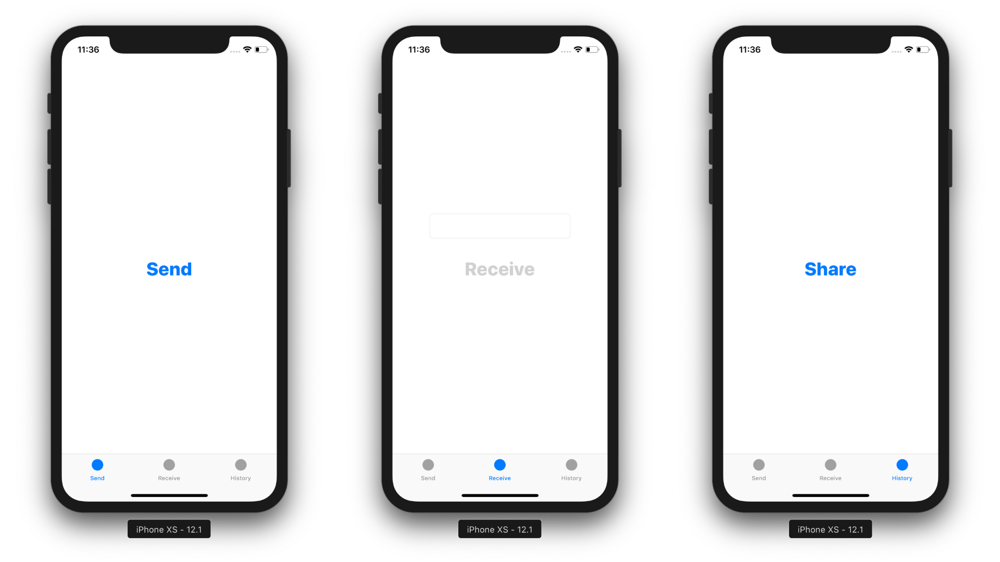
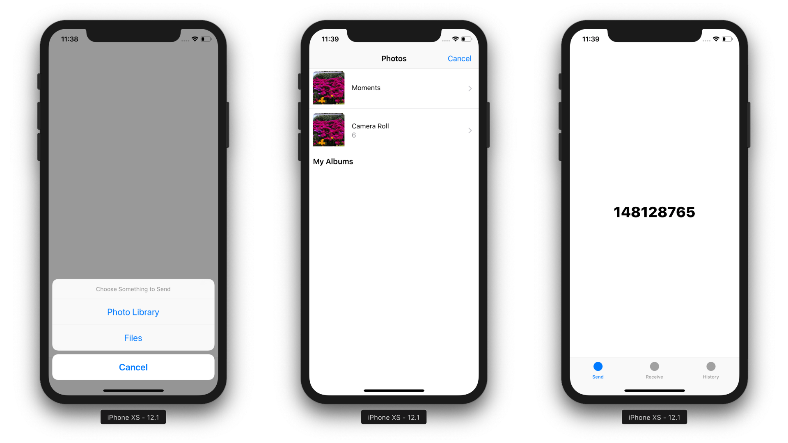
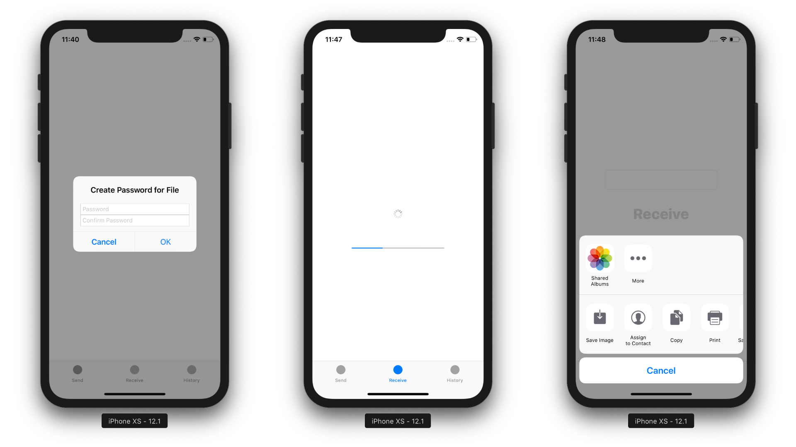

# Courier

**Courier is an end-to-end encrypted file transfer app for iOS.** Apple’s Common Crypto library provides symmetric encryption, hash-based message authentication codes, and digests used for encrypting and authenticating all data transferred. To transfer a file, the sender must first select a document, image, or video to send. Once they have selected a file, the server provides them with a randomly generated 9-digit code that identifies the transfer, and they must tell this code to the receiver. After the receiver enters this code in their app, the sender is prompted to create a password to encrypt the file during transfer, which they must also tell to the receiver. When the receiver enters this password, the transfer begins. The file is read, encrypted, and transferred in chunks using Socket.IO to avoid loading it into memory entirely at once. Files are encrypted on the sender’s device using AES-256-CBC and a cryptographically secure pseudorandom 128-bit initialization vector. Additionally, authentication and integrity of all transferred data is verified with HMAC-SHA256. The 256-bit encryption key and 256-bit HMAC key are derived from the password using PBKDF2-HMAC-SHA512 with a 512-bit salt and 1,000,000 iterations. If the receiver enters an incorrect password or HMAC verification fails, the file will not be decrypted and the transfer will stop. Once the transfer completes successfully, the receiver can save the file to their device or open it in another app.

## Server Setup Instructions

### Prerequisites

* Node.js 10.14.2
* npm 6.4.1

### Installation

1. Install Node.js dependencies

```
npm install
```

2. Create the .env file and add the variable PORT to it

### Running

1. Run the Node.js server

```
node index.js
```

## iOS App Setup Instructions

### Prerequisites

* Xcode 10.0
* Swift 4.2
* Carthage 0.31.2

### Installation

1. Install Carthage dependencies

```
carthage bootstrap --platform iOS
```

2. Set the server address in the Constants class

3. Build the app and run it on an iOS device

### Running

1. Launch the app on your device

## Screenshots






